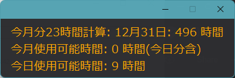

## 使用技術一覧
<!-- シールド一覧 -->
<!-- 該当するプロジェクトの中から任意のものを選ぶ-->

  <!-- バックエンドのフレームワーク一覧 -->
  
 

## プロジェクト名
### Time

## 目次

1. [プロジェクトについて](#プロジェクトについて)
2. [環境](#環境)
4. [機能説明](#機能説明)

## プロジェクトについて
今月の使える時間と一日に使える時間がどれくらいなのかを可視化できるアプリケーションです。

## デモ(図解)

  

 

## 環境

<!-- 言語、フレームワーク、ミドルウェア、インフラの一覧とバージョンを記載 -->

| 言語・フレームワーク  | バージョン |
| --------------------- | ---------- |
| C#           | 3.12.5     |
|   .NET FRAMEWORK                      |    4.8        |
|      SpireDocument                 |     7.11       |
|      DevExpress  |          22.2 
 

## 機能説明
【機能】
